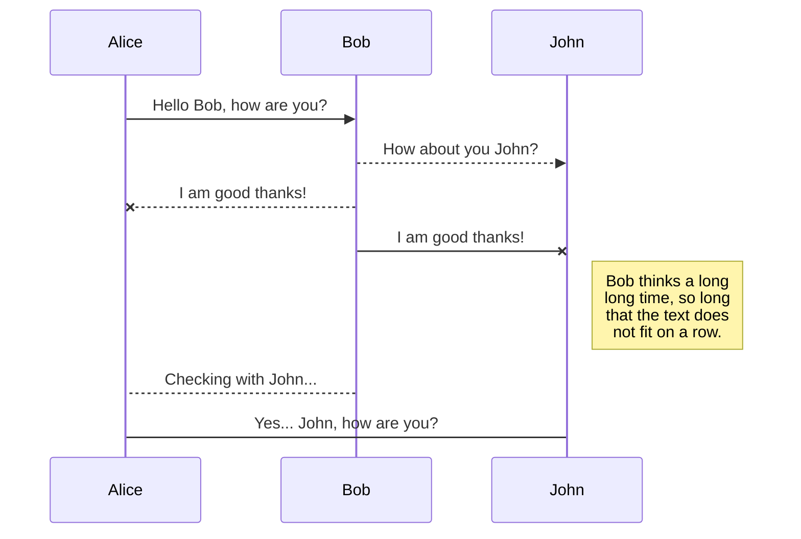
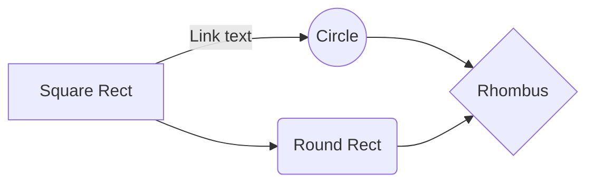

# 

# Hi there   !

- 👋 Hi, I’m Fardin, a Comp. Science student at [@UPC](https://github.com/UPC)
- 👀 Working [@TdD-Inc](https://github.com/TdD-Inc), an organization about knowledge development with friends.
- 🌱 Currently in the process of learning some languages, usage of various libraries and development apps
- 📫 To reach me, you can use the following links:
	- E-mail: contact@fardinarafat.tk
	-  GitHub: [@FardinA143](https://github.com/FardinA143)
	- LinkedIn: [LinkedIn/FardinA143](https://linkedin.com/in/FardinA143)
	- Twitter: [@hacker143ard](https://twitter.com/hacker143ard)

>quote

## Learnt technologies

<table>
<tbody>
  <tr>
    <td colspan="6">Programming languages</td>
  </tr>
  <tr>
    <td>C++</td>
    <td>Python</td>
    <td>Java</td>
    <td>Bash</td>
    <td>HTML</td>
    <td>asd</td>
  </tr>
  <tr>
    <td></td>
    <td></td>
    <td></td>
    <td></td>
    <td></td>
    <td></td>
  </tr>
  <tr>
    <td colspan="6">Libraries</td>
  </tr>
  <tr>
    <td>SFML</td>
    <td></td>
    <td></td>
    <td></td>
    <td></td>
    <td></td>
  </tr>
  <tr>
    <td></td>
    <td></td>
    <td></td>
    <td></td>
    <td></td>
    <td></td>
  </tr>
  <tr>
    <td colspan="6">Apps</td>
  </tr>
  <tr>
    <td>fdsdf</td>
    <td>asdasd</td>
    <td></td>
    <td></td>
    <td></td>
    <td></td>
  </tr>
  <tr>
    <td></td>
    <td></td>
    <td></td>
    <td></td>
    <td></td>
    <td></td>
  </tr>
</tbody>
</table>

<!--
## KaTeX

You can render LaTeX mathematical expressions using [KaTeX](https://khan.github.io/KaTeX/):

The *Gamma function* satisfying $\Gamma(n) = (n-1)!\quad\forall n\in\mathbb N$ is via the Euler integral

$$
\Gamma(z) = \int_0^\infty t^{z-1}e^{-t}dt\,.
$$

> You can find more information about **LaTeX** mathematical expressions [here](http://meta.math.stackexchange.com/questions/5020/mathjax-basic-tutorial-and-quick-reference).
-->

## UML diagrams

You can render UML diagrams using [Mermaid](https://mermaidjs.github.io/). For example, this will produce a sequence diagram:

And this will produce a flow chart:

